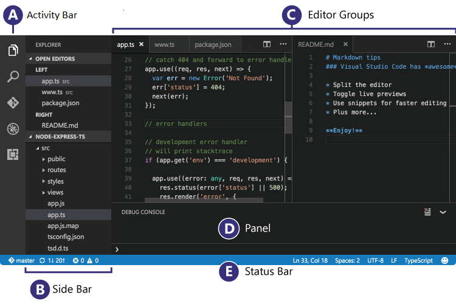

**[<== Back to Index](/Phaser-Tutorials/)**.

# Development Environment for Phaser Game Development
This is the first in a tutorial series that aims to help you get started with the Phaser game framework.  
In this first tutorial, we will focus on getting your development environment installed and properly configured.

# Table of Contents
<!-- vscode-markdown-toc -->
* 1. [Prerequisites](#Prerequisites)
* 2. [Visual Studio Code](#VisualStudioCode)
	* 2.1. [Installing VSCode](#InstallingVSCode)
	* 2.2. [Getting familiar with VSCode](#GettingfamiliarwithVSCode)
		* 2.2.1. [Interface](#Interface)
		* 2.2.2. [Activity Bar Icons](#ActivityBarIcons)
		* 2.2.3. [Integrated Terminal](#IntegratedTerminal)
* 3. [Initial Setup](#InitialSetup)
* 4. [Making Phaser Intellisense work](#MakingPhaserIntellisensework)
* 5. [Adding some Phaser javascript code](#AddingsomePhaserjavascriptcode)
* 6. [Cross-Origin Referencing](#Cross-OriginReferencing)
* 7. [Webserver](#Webserver)
	* 7.1. [Prerequisites](#Prerequisites-1)
	* 7.2. [Keybinding the server command](#Keybindingtheservercommand)
		* 7.2.1. [No-longer silent](#No-longersilent)
		* 7.2.2. [Shutting down the server](#Shuttingdowntheserver)
		* 7.2.3. [Keybinding it all](#Keybindingitall)
* 8. [Disabling Caching](#DisablingCaching)
* 9. [Debugging Phaser](#DebuggingPhaser)
	* 9.1. [Debugging in Google Chrome](#DebugginginGoogleChrome)
	* 9.2. [Breakpoints](#Breakpoints)
	* 9.3. [Sending messages to the debug console.](#Sendingmessagestothedebugconsole.)
* 10. [Typos, Errors, etc.](#TyposErrorsetc.)
	* 10.1. [Bonus stuff](#Bonusstuff)

<!-- vscode-markdown-toc-config
	numbering=true
	autoSave=true
	/vscode-markdown-toc-config -->
<!-- /vscode-markdown-toc -->
  
---

##  1. <a name='Prerequisites'></a>Prerequisites
In order to follow along more easily in this tutorial, I highly recommend you download the following items.

1. Download and install [Visual Studio Code](https://code.visualstudio.com/).
    * Special installation instructions below.
2. Download the latest version of [Phaser](https://phaser.io/).
    * Download the full zip-file version.
3. Download and install [Node.js](https://nodejs.org/en/download/).

Depending on your operating system, you may have to restart your computer after installing Visual Studio Code and/or Node.js.

##  2. <a name='VisualStudioCode'></a>Visual Studio Code
[Visual Studio Code](https://code.visualstudio.com/) is a simple, text-only, programming editor. While you can get larger and more feature rich editors, such as the full Visual Studio, we only need simple features.  
From here on out, I will refer to Visual Studio Code, as VSCode.

###  2.1. <a name='InstallingVSCode'></a>Installing VSCode
At some point during the install of VSCode, you will see a screen similar to the one below.  
In order to make your life a while lot easier, make sure the following options are checked:
  * Both "Open with Code" options
  * Add to PATH option.

You can also have it create a desktop icon for easier access to VSCode in the future.


> The above image highlights the options that helps make your life easier when working with VSCode.

###  2.2. <a name='GettingfamiliarwithVSCode'></a>Getting familiar with VSCode
It is a good idea to get familiar with some of the areas of VSCode, as I will refer to these names throughout the tutorial. If you want a full list of tips and tricks for VSCode, you can look here: [Collection of helpful tips and tricks for VSCode](https://github.com/Microsoft/vscode-tips-and-tricks)

####  2.2.1. <a name='Interface'></a>Interface
You can find a full description of all the interface features here: [[LINK]](https://code.visualstudio.com/docs/getstarted/userinterface), but I will primarily reference what is shown in this image.



####  2.2.2. <a name='ActivityBarIcons'></a>Activity Bar Icons
These icons represent the main/primary functionalities of VSCode, and as such you will likely be referring to them quite often.


####  2.2.3. <a name='IntegratedTerminal'></a>Integrated Terminal
We will also use the integrated terminal, which you can show by going to **[View➞Integrated Terminal]** (this will also tell you the keyboard shortcut for it, right next to it).


##  3. <a name='InitialSetup'></a>Initial Setup
We need to get our project set up so that we can begin.

> **NOTE:** If a folder name is written as `folder/`, you should **not** add the forward-slash `/` to the folder name. I only include those slashes in the folder names here, as that is how folders are viewed by many operating systems.

1. Create a folder for your project, if you want to use Version Control like Git, make a repository and clone it to your local machine.
2. Right-click the folder and choose **[Open with Code]**, if you do not have that option, simply open VSCode normally and choose **[File➞Open Folder]**.
3. In the Side Bar, right-click below where your projects folder name is and choose **[New Folder]**, do this several times and create the following folders:
    * `assets/`
    * `css/`
    * `js/`
    * `js/vendor/`
    * `defs/`   
4. In your `js/` folder, create a new file named `game.js`, you can leave it empty for now, but this is where we will add our game code.
5. Open the downloaded *Phaser* zip-file, and inside the `build` folder, copy all the files to your `js/vendor/` folder, **except** the following files:
    * the `custom/` folder
    * `config.php`
6. In the root of your project, create a new file named `index.html`, and add the following content:
```html
<!DOCTYPE html>
<html lang="en">
<head>
    <meta charset="UTF-8">
    <meta name="viewport" content="width=device-width, initial-scale=1.0">
    <meta http-equiv="X-UA-Compatible" content="ie=edge">
    <title>Phaser Test</title>
</head>
<body>
    <h1>Phaser Test</h1>
    <div id="content"></div>
    <script type="text/javascript" src="./js/vendor/phaser.js"></script>
    <script type="text/javascript" src="./js/game.js"></script>
</body>
</html>
```

> **Note #1:** In Visual Studio Code, in HTML documents as well as CSS files, you have access to [Emmet](https://emmet.io/), a code completion tool that will save you time typing common code, I highly recommend you check it out yourself.  
> *Example: In a blank HTML document, type `!` followed by hitting your [TAB] key twice, this will auto-generate some of the code above.*  

> **Note #2:** Adding the `<script>`-tags at the bottom of the `<body>`-tags, ensures that the document's markup (also known as DOM), is fully loaded before our scripts are. This way we can assume it loaded when working with it in Javascript.

##  4. <a name='MakingPhaserIntellisensework'></a>Making Phaser Intellisense work
In order to get Phase Intellisense to properly work, some files need to be copied and created.

1. Open the `defs/` folder in your file browser.
2. Open the downloaded *Phaser* zip-file, and inside the `typescript` folder, copy the following file to your `defs/` folder:
    * `box2d.d.ts`
    * `p2.d.ts`
    * `phaser.comments.d.ts`
    * `phaser_box2d.d.ts`
    * `pixi.comments.d.ts`
    * `tslint.json`
    * `typings.json`

The files inside the `defs/` folder are needed to make VSCode's intellisense recognize Phaser, but even after all this, it still won't work, we need *one* more thing done for intellisense to work.  
In the root of your project, create a new file named `jsconfig.json`, with the following content inside:
```json
{ }
```
This simply tells VSCode that your project is a Javascript project, and then it looks for additional definitions in the `defs/` folder, and loads them for intellisense.

> You can add settings to your `jsconfig.json` file, but it is outside the scope of this tutorial to explain that.

##  5. <a name='AddingsomePhaserjavascriptcode'></a>Adding some Phaser javascript code
In this chapter we will add some Phaser code, it is only very basic code and not a fully functional game, for that you can find other tutorials.

This chapter is also a perfect opportunity for you to test out how the Intellisense now work. 

Open your `game.js`-file from your `js/` folder, and add the following code.
Feel free to copy/paste it, so you get to keep my comments, they explain what each part does.

```javascript
// Here we create our game object, with a width of 800 pixels 
// and a height of 600, Phaser.AUTO is us telling it to 
// automatically choose the correct render engine (canvas or webgl).
// 'content' is the id of the parent html element we want to 
// target.
var game = new Phaser.Game(800, 600, Phaser.AUTO, 'content', {
    // This tells Phaser that for preload, use our own function 
    // for it.
    preload: preload,
    // Same goes for the create function.
    create: create,
    // ... and the update function.
    update: update
});

// This will be called when the game first starts, allowing you 
// to preload assets and set up important global variables before 
// the actual game logic begins.
function preload() {}

// This is called right after the preload, and creates the actual
// game, here you can use the things you added in preload to create
// your game!
function create() {}

// The very important update function, it is called every frame.
// There is of course always the problem that slow browsers will
// call it less often, but most modern browsers will run it just
// fine.
function update() {}
```

This itself does nothing, as the game contains no actual "stuff" for us to display and debug against, so let's add that.

Download the following image: [[LINK]](https://cdn.discordapp.com/icons/172773076881113090/f9ee342ca79fbaef5a869dfe7d8803cd.png)


I suggest renaming the file, in my case I renamed it to `ggc.png` and put it into the `assets/` folder, I highly recommend you do the same, so you can more easily follow along.  
Let's add the image to our game. First we need to preload it, to make sure it is loaded into memory so we can render it later.
Add the following code inside the `game.js`'s `preload()` function:

```javascript
// Here we load the image into the game objects memory, and
// assign it the key 'logo' for future reference.
game.load.image('logo', 'assets/ggc.png');
// Here we simply assign the background color to the game
// stage, to make to fit nicely with our logo.
// Note: you can also use other ways to set color as noted below.
game.stage.backgroundColor = "#533D91";
// game.stage.backgroundColor = 0x533d91;
// game.stage.backgroundColor = 'rgb(84, 61, 154)';
// game.stage.backgroundColor = 'rgba(84, 61, 154, 1.0)';
```

As you can see from the code, I also define the stage's background color, this is simply to make it look prettier. You can use Intellisense to look through what else you can define for the game object.  
Now we also need to actually *render* the image, so lets do that by adding the following code to the `game.js`'s *create()* function:

```javascript
// Now we add our logo that was preloaded, as a sprite to 
// the game itself, we want it to be centered on the X and Y 
// of the gameworld, and we reference the key that we 
// defined during preload of the logo.
var logo = game.add.sprite(game.world.centerX, game.world.centerY, 'logo');
// While we already told the logo to be centered in our game
// world, that is only relative to it's own achor point, 
// This way to tell the logo that it's anchor point is in 
// the center of itself.
logo.anchor.setTo(0.5, 0.5);
```

> I highly suggest reading all the comments to get a better idea of what the code is doing.

##  6. <a name='Cross-OriginReferencing'></a>Cross-Origin Referencing
If you view the `index.html` in your browser now, you should be greeted by a big purple rectangle... but no image.  
This is because of something called *cross-origin referencing*. My explanation here will not be very thorough, if you want a much more detailed explanation, there are plenty resources on the subject to find online.  
*Cross-origin referencing* happens when a website uses one protocol, in our case `file:\\\`, while some parts of it uses another protocol, in our case javascript tries to use the `http://` protocol. 

Modern browsers tend to block references from a different origin than the source document for security reasons, for all it knows, it could be some virus/malware that is trying to inject malicious code into your website.  
Some browsers, like Firefox, recognizes that we are viewing a local file, and does not block it, even though it would if it was a real website, so do not be alarmed if you use Firefox and it works fine.

> That being said, make sure to understand how your browser handles cross-origin referencing, if your browser doesn't handle it, or handles it badly, I highly recommend switching to a more secure browser.

When viewing the page, if we open the developer tools (in most browsers this is done by hitting F12), and go to it's *Console* tab, we can see the error we are getting, specifically mentioning cross-origin.

In the next chapter we will install a small, simple, local server that will help us view the website properly without getting any cross-origin errors.

##  7. <a name='Webserver'></a>Webserver
In order to avoid the whole *cross-origin* problem, regardless of which browser you use, we will run a small server to host the files via a `http://` protocol, the same as the javascript does.  
If you have a server, and know how to use it for this, then you can skip this chapter.

###  7.1. <a name='Prerequisites-1'></a>Prerequisites
We need some additional software installed, in order to get the server going.

1. In VSCode, open the Integrated Terminal **[View➞Integrated Terminal]** and type `node -v`. This should return a version number, something like `v6.10.0` and is the version number of Node.js, indicating that it is recognized by VSCode and properly installed.

2. Install the no-nonsense server, called [HTTP-Server](https://github.com/indexzero/http-server), by running the following command in the Integrated Terminal: `npm install http-server`, it will run for a bit and is done when you can type in the terminal again. It is a simple server that requires zero configuration and is run via our integrated terminal.

3. Again, in the Integrated Terminal, type the following command to start the server: `.\node_modules\.bin\http-server -s`
    * *We tell it the path to the installed http-server command, which is why it starts with a long path string*. 
    * *the -s means silent, as we don't need the message spam, but you are welcome to not use it, if you want to see the spam*. 

> **IMPORTANT:** The server does not shut down itself, it is too simple for that, to shut it down once you're done using it, make sure the Integrated Terminal is selected and has focus and hit *CTRL+C*. You will know that is has properly shut down if you are allowed to type in the terminal again.

You should now be able to open your browser and go to [http://localhost:8080](http://localhost:8080) to view your index.html, this time with the image properly displayed, and no cross-origin error in the Developer Tools Console.  
You will have to start and shut down the server every time you want to correctly run the code, but you do not have to stop/start between you saving files, if the server is running, simply reload the browser page for the changes to update.

###  7.2. <a name='Keybindingtheservercommand'></a>Keybinding the server command
It can get annoying having to remember, type or copy/paste the command for starting the server every time you want to start working with your project.  
So let's make a keybinding for it.

> VSCode sadly does not support us adding a keybinding directly to a terminal command, instead we will create a task that runs the command and then keybind that.

1. Open your **Command Palette** by hitting *CTRL+SHIFT+P*, *F1*, or finding it under **[View➞Command Palette...]**.
2. Type `task` into it, and select the option called **Tasks: Configure Task Runner**.
3. In the menu that asks you to select a task runner, choose **Other**, as we just want a very basic command executed, nothing special.

You should now have a new file in your `.vscode/` folder, called `tasks.json`, which is likely already opened for you.  
Replace the content of the file with the following code:

```json
{
    // See https://go.microsoft.com/fwlink/?LinkId=733558
    // for the documentation about the tasks.json format
    "version": "0.1.0",
    "tasks": [
        {
            "taskName": "runServer",
            "command": ".\\node_modules\\.bin\\http-server",
            "isShellCommand": true,
            "showOutput": "always",
            "promptOnClose": true,
            "isBackground": true
        }
    ]
}
```

This code tells VSCode that we have a task named *runServer* that runs our command `.\node_modules\.bin\http-server` as a shell command, in the background. It is also told that it should prompt us if the task is running when we close VSCode, and to always show the output.

> The `"promptOnClose": true,` line is especially useful, it will prevent you from closing VSCode if it has a task running, instead you will be asked if you want to terminate the task and then close VSCode.  
> This will prevent the server from running when not using VSCode.

####  7.2.1. <a name='No-longersilent'></a>No-longer silent  
We do not pass the `-s` argument with the task's command, this is because task output it sent to the **Output** tab *not* the **Terminal** tab, meaning we can still use the terminal without huge amounts of spam, as well as we have access to the output if we need it.

####  7.2.2. <a name='Shuttingdowntheserver'></a>Shutting down the server
When run as a task, we can no-longer shut it down with *CTRL+C*, instead we have to tell VSCode to terminate the task.  
Here is how you do that:

1. Open your **Command Palette**, as explained previously.
2. Type in `Terminate`, you can probably stop before typing the full word.
3. Select the option called **Tasks: Terminate Running Task**, this will shut down the server.

####  7.2.3. <a name='Keybindingitall'></a>Keybinding it all
Having a task available doesn't really save us much time if we have to launch it through the command palette, we want to be able to hit a combination of keys to have it run the task.

1. Select **[File➞Preferences➞Keyboard Shortcuts]**.
2. Click the link **keybindings.json**, right below the search bar in the window that opens, this will let you customize your keybindings.
3. Click the **Define Keybinding** button, followed by the key combination you want to use for launching the server. I suggest using *CTRL+ALT+S* (S for Server), hit *[ENTER]* as told by the input window.
4. It has now added our keybinding to the window with the blue button, but we need to tell it our command.
    * change where it says `"commandId"` to `"workbench.action.tasks.runTask"`.
    * replace the line where it says `"when": "editorTextFocus"` with this: `"args": "runServer"`.
5. When you save the file, your keybinding should then work.

Let's also create a keybinding for terminating the running task, just to make our lives easier.

1. In the keybinding window with the blue **Define Keybinding** button, click it and give it the key combination you want to terminate the running task. I suggest using *CTRL+ALT+X*, hit *[ENTER]* as told by the input window.
2. Replace the `"commandId"` with `"workbench.action.tasks.terminate"`.
3. Remove the comma `,` from the end of the line where we just added the command.
4. Remove the line where it says `"when": "editorTextFocus"`, as we do not need it.

We now have keybindings for both starting the `runServer` task, as well as one for terminating the currently running task.  
This will make life a lot easier when it comes to starting the project again after having it closed.

##  8. <a name='DisablingCaching'></a>Disabling Caching
To avoid a lot of potential headaches, we want to make sure that the browser doesn't cache, this is not a 100% fool-proof solution, as browsers update and sometimes change how they approach content caching.

I highly suggest not to disable caching on any code that is considered *live*, as-in, used on websites that are in use, as this can worsen the experience of the visitors. This chapter is purely to make *developing* easier.

> Caching is a practice used by browsers to locally save website content, such as images, css and sometimes also javascript, so that when you visit that website again, it will load faster.  
> Most websites tell browsers when they should cache the website again, allowing websites to serve new content quickly while still keeping the speed benefits of caching.

For now, add the following HTML-code to your index.html, right before the `<title>`-tag.
```html
<meta http-equiv="cache-control" content="max-age=0" />
<meta http-equiv="cache-control" content="no-cache, no-store, must-revalidate"/>
<meta http-equiv="expires" content="0" />
<meta http-equiv="expires" content="Tue, 01 Jan 1980 1:00:00 GMT" />
<meta http-equiv="pragma" content="no-cache" />
```
It should now look something like this:  
*(the `...` are just there to illustrate that there are more unchanged html before and after the code snippet)*
```html
...
<head>
    <meta charset="UTF-8">
    <meta name="viewport" content="width=device-width, initial-scale=1.0">
    <meta http-equiv="X-UA-Compatible" content="ie=edge">
    <meta http-equiv="cache-control" content="max-age=0" />
    <meta http-equiv="cache-control" content="no-cache, no-store, must-revalidate"/>
    <meta http-equiv="expires" content="0" />
    <meta http-equiv="expires" content="Tue, 01 Jan 1980 1:00:00 GMT" />
    <meta http-equiv="pragma" content="no-cache" />
    <title>Phaser Test</title>
</head>
...
```

##  9. <a name='DebuggingPhaser'></a>Debugging Phaser
In order to help you develop games with Phaser, knowing how to debug your code is crucial, this chapter will explain 2 key parts of debugging; breakpoints and sending debug console log messages.  

There are multiple extensions that allow for debugging in different browsers, we will focus on Google Chrome, as it is the most commonly used browser.

> If you want to debug in Firefox, search for the extension called *Debugger for Firefox*, it also has sample code to get you started.

###  9.1. <a name='DebugginginGoogleChrome'></a>Debugging in Google Chrome
If you want to debug your code properly in Google Chrome, here we will explain what VSCode Extension to install and how to configure it so that debugging will work for you.

1. Click the icon for the **Extension Manager** in the **Activity Bar** in VSCode.

2. In the search field at the top of the **Side Bar** search for `Debugger for Chrome`.

3. Click the green **Install** button, once the button changes into a blue **Reload** button, the install has completed and you need to click the **Reload** button in order to reload VSCode and properly load the extension.

4. Open your `index.html` and hit **F5**, this should bring up a menu asking you to select an environment, this is VSCode's debugger that needs to know what kind of debugging environment it is dealing with. You should see an option for `chrome`, choose that.

5. This should auto generate a `.vscode/` folder and inside it, a `launch.json` file, which it should also have opened. In case that didn't happen, you can create the folder and file yourself, the content of the file is as follows:

```json
{
    "version": "0.2.0",
    "configurations": [
        {
            "type": "chrome",
            "request": "launch",
            "name": "Launch Chrome against localhost",
            "url": "http://localhost:8080",
            "webRoot": "${workspaceRoot}",
            "disableNetworkCache": true,
            "runtimeArgs": [ "--disk-cache-size=1" ]
        },
        {
            "type": "chrome",
            "request": "attach",
            "name": "Attach to Chrome",
            "port": 9222,
            "webRoot": "${workspaceRoot}",
            "disableNetworkCache": true
        }
    ]
}
```
> **NOTE:** Comments were removed from the previous code-block to prevent it from breaking the PDF layout, feel free to ask me if you have any questions about it.*

6. Now VSCode knows what to do when you hit F5, it will launch Google Chrome with the address of `http://localhost:8080`, which just so happens to be the same address we can find our code at, when running the local server, perfect!

7. When you have the local server running, you can now hit F5 to launch Google Chrome for debugging (and VSCode will display a debugging toolbar at the very top)

> **IMPORTANT:** If you have Google Chrome running, either in the background or some other way, then debugging will be unable to connect to it, as it can only enable remote debugging on a clean browser start.    
> In those cases, make sure all Google Chrome windows/tabs are closed, and it isn't running in the background, then you can hit F5 and the debugger will connect properly.  
> This might change in future updates of the Chrome Debugger.

###  9.2. <a name='Breakpoints'></a>Breakpoints
Breakpoints is a way to tell the debugger to stop execution of our code, at the point we specify. In VSCode you specify a breakpoint the same was as in many other programming tools, by clicking in the left margin that also has the line numbers. A red dot appears when a breakpoint has been set, and it can be removed by clicking it again.


> For the more advanced needs, you can right-click the breakpoint and make a conditional breakpoint instead, such as one that only triggers when certain conditions are met.

When the debugger is running properly, and it encounters a breakpoint, it will stop executing your code from that point on, and you will be shown the line it breaks at, inside VSCode. This tells you that your code was reached, so it is useful for checking if your code is reachable.

When a breakpoint is hit, you can hit F5 again to let the debugger continue until it encounters another (or the same) breakpoint again.

###  9.3. <a name='Sendingmessagestothedebugconsole.'></a>Sending messages to the debug console.
Sometimes you want to output some test information, maybe a calculated value or something similar, being able to output that to VSCode's debug console (can be seen as the tab right next to **terminal** when you have the Integrated Terminal open).  
Let's see if we can output a message to the console, that tells us the width and height of the image we used.

Add the following to your `game.js`'s `create()` function, I suggest somewhere **after** we define the `logo` variable.

```javascript
// Send message to debug console with the logo width
// Width and height should both be 128
console.debug("Logo Width:".concat(logo.width));
console.debug("Logo Height:".concat(logo.height));
```

If you save the file, make sure the server is running, and then enable debugging by hitting F5, it should now display in the debug console (both in VSCode and the browsers own Developer Tools Console).
It should look something like this:


You can now output messages to the console, enjoy being able to debug more abstract data.

##  10. <a name='TyposErrorsetc.'></a>Typos, Errors, etc.
If you find any typos or errors in this tutorial, or you are simply stuck. You can reach me on [Discord](https://discordapp.com) as `Graloth#6217` or via email on <dion@graloth.com>.

###  10.1. <a name='Bonusstuff'></a>Bonus stuff
If you like VSCode as much as me, you might want to customize it a bit, to make it fit you better. I would then suggest looking at the following links.

* [(Font) Fira Code](https://github.com/tonsky/FiraCode)
* [(Theme) Hopscotch](https://marketplace.visualstudio.com/items?itemName=idleberg.hopscotch)
* [(Extension) Guides](https://marketplace.visualstudio.com/items?itemName=spywhere.guides)
* [(Icon Theme) Nomo Dark Icon](https://marketplace.visualstudio.com/items?itemName=be5invis.vscode-icontheme-nomo-dark)

If you want to browse all the available extensions, themes, icon themes, debuggers, etc. etc., have a look at the [Extension Marketplace for Visual Studio Code](https://marketplace.visualstudio.com/vscode).